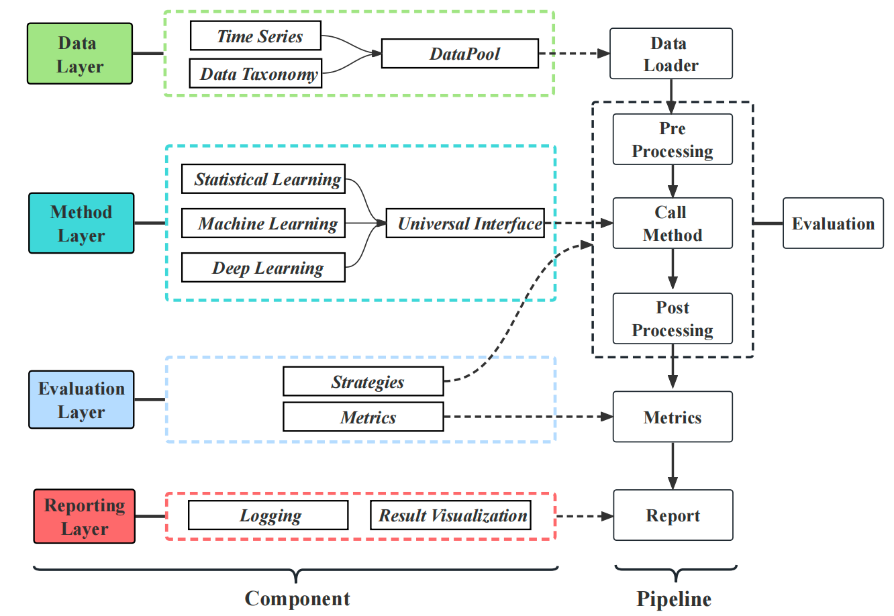
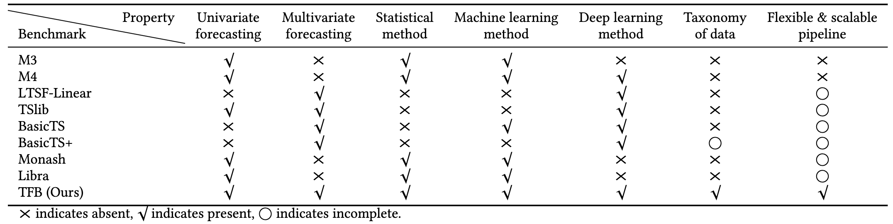

# sample-notebooks-causal-inference-ts-forecasting
Sample set of notebooks that explore time-series forecasting and causal inference. We use [AutoGluonTS](https://auto.gluon.ai/stable/tutorials/timeseries/forecasting-quick-start.html), [Chronos](https://github.com/amazon-science/chronos-forecasting?tab=readme-ov-file), [Uni2TS](https://github.com/SalesforceAIResearch/uni2ts/tree/main), [DoWhy](https://github.com/py-why/dowhy), and others.

## 📖 Quick Index
* [Time-series forecasting frameworks](#time-series-forecasting-frameworks)
  - [AutoGluonTS](#autogluonts)
  - [Uni2TS](#uni2ts)
* [Time-series forecasting models & research](#time-series-forecasting-models--research)
  - [KAN4TSF: Are KAN and KAN-based models Effective for Time Series Forecasting?](#kan4tsf-are-kan-and-kan-based-models-effective-for-time-series-forecasting)
* [Environment setup](#environment-setup)
* [Model deployment as API](#model-deployment-as-api)
  - [amazon/chronos-t5-large](#amazonchronos-t5-large)
  - [Salesforce/moirai-1.0-R-large](#salesforcemoirai-10-r-large)
* [Pre-training & fine-tuning](#pre-training--fine-tuning)
  - [Chronos](#chronos)
  - [moirai_1.0_R](#moirai_10_r)
* [Benchmarking](#benchmarking)
  - [TFB: Towards Comprehensive and Fair Benchmarking of Time Series Forecasting Methods](#tfb-towards-comprehensive-and-fair-benchmarking-of-time-series-forecasting-methods)
  - [Trying out time-series-based models on Google Colab ④: Amazon Chronos-T5](#trying-out-time-series-based-models-on-google-colab--amazon-chronos-t5)
* [Resources](#resources)
* [License](#license)

## Time-series forecasting frameworks

### `AutoGluonTS`
[AutoGluon](https://auto.gluon.ai/stable/tutorials/timeseries/forecasting-quick-start.html) can forecast the future values of multiple time series given the historical data and other related covariates. A single call to `AutoGluon` `TimeSeriesPredictor`’s `fit()` method trains multiple models to generate accurate probabilistic forecasts, and does not require you to manually deal with cumbersome issues like model selection and hyperparameter tuning.

Under the hood, `AutoGluon` combines various state of the art forecasting algorithms. These include established statical methods like ETS and ARIMA from StatsForecast, efficient tree-based forecasters like `LightGBM` based on `AutoGluon-Tabular`, flexible deep learning models like `DeepAR` and `Temporal Fusion Transformer` from `GluonTS`, and a pretrained zero-shot forecasting model, `Chronos`.

### `Uni2TS`

[Uni2TS](https://github.com/SalesforceAIResearch/uni2ts/tree/main) is a PyTorch based library for research and applications related to Time Series Transformers. This library aims to provide a unified solution to large-scale pre-training of Universal Time Series Transformers. Uni2TS also provides tools for fine-tuning, inference, and evaluation for time series forecasting. Uni2TS relies on GluonTS for inference as it provides many convenience functions for time series forecasting, such as splitting a dataset into a train/test split and performing rolling evaluations, and others.

## Time-series forecasting models & research
### [KAN4TSF: Are KAN and KAN-based models Effective for Time Series Forecasting?](https://arxiv.org/abs/2408.11306)
The introduction of the Kolmogorov-Arnold Network (KAN) marked an important contribution to the field of deep learning, as it represented an alternative to the multilayer perceptron (MLP).

The MLP is of course the building block of many deep learning models, including state-of-the-art forecasting methods like N-BEATS, NHiTS and TSMixer.

However, in a forecasting benchmark using KAN, MLP, NHiTS and NBEATS, we discovered that KAN was generally very slow and consistently performed worse on various forecasting tasks. Note that the benchmark was done on the M3 and M4 datasets, which contain more than 99 000 unique time series with frequencies ranging from hourly to yearly.

Ultimately, at that time, applying KANs for time series forecasting was disappointing and not a recommended approach.

This has changed now with Reversible Mixture of KAN (RMoK) as introduced in the paper: KAN4TSF: Are KAN and KAN-based Models Effective for Time Series Forecasting?

* Notebook example: https://github.com/marcopeix/time-series-analysis/blob/master/rmok_blog.ipynb
* Medium article: "[Mixture of KAN Experts for High-Performance Time Series Forecasting](https://towardsdatascience.com/mixture-of-kan-experts-for-high-performance-time-series-forecasting-5227e1d2aba2)"

## Environment setup
I'm into `Mamba` now, so these are the steps you need do to setup your environment. Run the following on your terminal to download `Mamba`.

```bash
$ curl -L -O "https://github.com/conda-forge/miniforge/releases/latest/download/Mambaforge-$(uname)-$(uname -m).sh"
$ bash Mambaforge-$(uname)-$(uname -m).sh
```

And then run the following to build your environment
```bash
$ mamba env create -f environment.yml
$ conda activate machinelearnear-ts-causal-inference
```

This will install everything you need, including `DoWhy`, `AutoGluonTS`, and then `Chronos`.

Additionally, you could just use your own `Python` environment and then run

```bash
$ pip install -r requirements.txt
```

## Model deployment as API
### `amazon/chronos-t5-large`

:rocket: Chronos pre-trained models for time series forecasting are now available on SageMaker JumpStart! :rocket:
[Chronos](https://github.com/amazon-science/chronos-forecasting?tab=readme-ov-file) is a family of time series forecasting models developed by Amazon. Chronos models are pre-trained on a large collection of open-source time series data and can generate accurate probabilistic & point forecasts in zero-shot manner.
JumpStart makes it easy to deploy production-ready endpoints serving `chronos-t5-small`, `chronos-t5-base` or `chronos-t5-large` models through either `SageMaker Studio` or `SageMaker SDK`.

Example deploying a chronos-t5-base endpoint via SageMaker Python SDK:

```python
from sagemaker.jumpstart.model import JumpStartModel

model = JumpStartModel(
    model_id="autogluon-forecasting-chronos-t5-base",
    role="AmazonSageMaker-ExecutionRole-XXXXXXXXXXXXXXX",  # replace with your SageMaker execution role
)

predictor = model.deploy(
    instance_type="g5.xlarge",  # single-GPU g5, p3, g4dn instances supported
)
```

Example forecasting two univariate time series:
```python
payload = {
    "inputs": [
        {"target": [1.0, 2.0, 3.0, 2.0, 0.5, 2.0, 3.0, 2.0, 1.0], "item_id": "product_A"},
        {"target": [5.4, 3.0, 3.0, 2.0, 1.5, 2.0, -1.0], "item_id": "product_B"},
    ],
    "parameters": {
        "prediction_length": 5,
    }
}

response = predictor.predict(payload)
```

Check out the [SageMaker Studio](https://aws.amazon.com/sagemaker/studio/) webpage for Chronos models for more information on model usage.
The models are already live and ready to use both via SageMaker Studio and the SageMaker SDK!

### `Salesforce/moirai-1.0-R-large`

**How to deploy this model using `Amazon SageMaker`?**

```python
import sagemaker
import boto3
from sagemaker.huggingface import HuggingFaceModel

try:
	role = sagemaker.get_execution_role()
except ValueError:
	iam = boto3.client('iam')
	role = iam.get_role(RoleName='sagemaker_execution_role')['Role']['Arn']

# Hub Model configuration. https://huggingface.co/models
hub = {
	'HF_MODEL_ID':'Salesforce/moirai-1.0-R-large',
	'HF_TASK':'time-series-forecasting'
}

# create Hugging Face Model Class
huggingface_model = HuggingFaceModel(
	transformers_version='4.37.0',
	pytorch_version='2.1.0',
	py_version='py310',
	env=hub,
	role=role, 
)

# deploy model to SageMaker Inference
predictor = huggingface_model.deploy(
	initial_instance_count=1, # number of instances
	instance_type='ml.m5.xlarge' # ec2 instance type
)

```

And here's a simple example to get you started:

```python
import torch
import matplotlib.pyplot as plt
import pandas as pd
from gluonts.dataset.pandas import PandasDataset
from gluonts.dataset.split import split

from uni2ts.eval_util.plot import plot_single
from uni2ts.model.moirai import MoiraiForecast, MoiraiModule


SIZE = "small"  # model size: choose from {'small', 'base', 'large'}
PDT = 20  # prediction length: any positive integer
CTX = 200  # context length: any positive integer
PSZ = "auto"  # patch size: choose from {"auto", 8, 16, 32, 64, 128}
BSZ = 32  # batch size: any positive integer
TEST = 100  # test set length: any positive integer

# Read data into pandas DataFrame
url = (
    "https://gist.githubusercontent.com/rsnirwan/c8c8654a98350fadd229b00167174ec4"
    "/raw/a42101c7786d4bc7695228a0f2c8cea41340e18f/ts_wide.csv"
)
df = pd.read_csv(url, index_col=0, parse_dates=True)

# Convert into GluonTS dataset
ds = PandasDataset(dict(df))

# Split into train/test set
train, test_template = split(
    ds, offset=-TEST
)  # assign last TEST time steps as test set

# Construct rolling window evaluation
test_data = test_template.generate_instances(
    prediction_length=PDT,  # number of time steps for each prediction
    windows=TEST // PDT,  # number of windows in rolling window evaluation
    distance=PDT,  # number of time steps between each window - distance=PDT for non-overlapping windows
)

forecasts = predictor.predict(test_data.input) # you have created `predictor` in the previous step, it's your Sagemaker endpoint

input_it = iter(test_data.input)
label_it = iter(test_data.label)
forecast_it = iter(forecasts)

inp = next(input_it)
label = next(label_it)
forecast = next(forecast_it)

plot_single(
    inp, 
    label, 
    forecast, 
    context_length=200,
    name="pred",
    show_label=True,
)
plt.show()
```

## Pre-training & fine-tuning

### `Chronos`

- Install this package with with the `training` extra:
    ```
    pip install "chronos[training] @ git+https://github.com/amazon-science/chronos-forecasting.git"
    ```
- Convert your time series dataset into a GluonTS-compatible file dataset. We recommend using the arrow format. You may use the `convert_to_arrow` function from the following snippet for that. Optionally, you may use [synthetic data from KernelSynth](#generating-synthetic-time-series-kernelsynth) to follow along.
    ```py
    from pathlib import Path
    from typing import List, Union

    import numpy as np
    from gluonts.dataset.arrow import ArrowWriter


    def convert_to_arrow(
        path: Union[str, Path],
        time_series: Union[List[np.ndarray], np.ndarray],
        compression: str = "lz4",
    ):
        """
        Store a given set of series into Arrow format at the specified path.

        Input data can be either a list of 1D numpy arrays, or a single 2D
        numpy array of shape (num_series, time_length).
        """
        assert isinstance(time_series, list) or (
            isinstance(time_series, np.ndarray) and
            time_series.ndim == 2
        )

        # Set an arbitrary start time
        start = np.datetime64("2000-01-01 00:00", "s")

        dataset = [
            {"start": start, "target": ts} for ts in time_series
        ]

        ArrowWriter(compression=compression).write_to_file(
            dataset,
            path=path,
        )


    if __name__ == "__main__":
        # Generate 20 random time series of length 1024
        time_series = [np.random.randn(1024) for i in range(20)]

        # Convert to GluonTS arrow format
        convert_to_arrow("./noise-data.arrow", time_series=time_series)
    ```
- Modify the [training configs](training/configs) to use your data. Let's use the KernelSynth data as an example.
    ```yaml
    # List of training data files
    training_data_paths:
    - "/path/to/kernelsynth-data.arrow"
    # Mixing probability of each dataset file
    probability:
    - 1.0
    ```
    You may optionally change other parameters of the config file, as required. For instance, if you're interested in fine-tuning the model from a pretrained Chronos checkpoint, you should change the `model_id`, set `random_init: false`, and (optionally) change other parameters such as `max_steps` and `learning_rate`.
- Start the training (or fine-tuning) job:
    ```sh
    # On single GPU
    CUDA_VISIBLE_DEVICES=0 python training/train.py --config /path/to/modified/config.yaml

    # On multiple GPUs (example with 8 GPUs)
    torchrun --nproc-per-node=8 training/train.py --config /path/to/modified/config.yaml

    # Fine-tune `amazon/chronos-t5-small` for 1000 steps with initial learning rate of 1e-3
    CUDA_VISIBLE_DEVICES=0 python training/train.py --config /path/to/modified/config.yaml \
        --model-id amazon/chronos-t5-small \
        --no-random-init \
        --max-steps 1000 \
        --learning-rate 0.001
    ```
    The output and checkpoints will be saved in `output/run-{id}/`.
> [!TIP]  
> If the initial training step is too slow, you might want to change the `shuffle_buffer_length` and/or set `torch_compile` to `false`.

> [!IMPORTANT]  
> When pretraining causal models (such as GPT2), the training script does [`LastValueImputation`](https://github.com/awslabs/gluonts/blob/f0f2266d520cb980f4c1ce18c28b003ad5cd2599/src/gluonts/transform/feature.py#L103) for missing values by default. If you pretrain causal models, please ensure that missing values are imputed similarly before passing the context tensor to `ChronosPipeline.predict()` for accurate results.
- (Optional) Once trained, you can easily push your fine-tuned model to HuggingFace🤗 Hub. Before that, do not forget to [create an access token](https://huggingface.co/settings/tokens) with **write permissions** and put it in `~/.cache/huggingface/token`. Here's a snippet that will push a fine-tuned model to HuggingFace🤗 Hub at `<your_hf_username>/chronos-t5-small-fine-tuned`.
    ```py
    from chronos import ChronosPipeline

    pipeline = ChronosPipeline.from_pretrained("/path/to/fine-tuned/model/ckpt/dir/")
    pipeline.model.model.push_to_hub("chronos-t5-small-fine-tuned")
    ```

Source: https://github.com/amazon-science/chronos-forecasting/tree/main/scripts

### `moirai_1.0_R`

Firstly, let's see how to use Uni2TS to fine-tune a pre-trained model on your custom dataset. 
Uni2TS uses the [Hugging Face datasets library](https://github.com/huggingface/datasets) to handle data loading, and we first need to convert your dataset into the Uni2TS format. 
If your dataset is a simple pandas DataFrame, we can easily process your dataset with the following script.
We'll use the ETTh1 dataset from the popular [Long Sequence Forecasting benchmark](https://github.com/thuml/Time-Series-Library) for this example.
For more complex use cases, see [this notebook](example/prepare_data.ipynb) for more in-depth examples on how to use your custom dataset with Uni2TS.

1. To begin the process, add the path to the directory where you want to save the processed dataset into the ```.env``` file.
```shell
echo "CUSTOM_DATA_PATH=PATH_TO_SAVE" >> .env
```

2. Run the following script to process the dataset into the required format. For the ```dataset_type``` option, we support `wide`, `long` and `wide_multivariate`.
```shell
python -m uni2ts.data.builder.simple ETTh1 dataset/ETT-small/ETTh1.csv --dataset_type wide
```

However, we may want validation set during fine-tuning to perform hyperparameter tuning or early stopping.
To additionally split the dataset into a train and validation split we can use the mutually exclusive ```date_offset``` (datetime string) or ```offset``` (integer) options which determines the last time step of the train set.
The validation set will be saved as DATASET_NAME_eval.
```shell
python -m uni2ts.data.builder.simple ETTh1 dataset/ETT-small/ETTh1.csv --date_offset '2017-10-23 23:00:00'
```

3. Finally, we can simply run the fine-tuning script with the appropriate [training](cli/conf/finetune/data/etth1.yaml) and [validation](cli/conf/finetune/val_data/etth1.yaml) data configuration files.
```shell
python -m cli.train \
  -cp conf/finetune \
  run_name=example_run \ 
  model=moirai_1.0_R_small \ 
  data=etth1 \ 
  val_data=etth1  
```

## Benchmarking

### [TFB: Towards Comprehensive and Fair Benchmarking of Time Series Forecasting Methods](https://arxiv.org/abs/2403.20150)

TFB is an open-source library designed for time series forecasting researchers. It proposes a framework for more rigorous, standardized evaluation of forecasting methods across domains. They provide a clean codebase for end-to-end evaluation of time series forecasting models, comparing their performance with baseline algorithms under various evaluation strategies and metrics. [Here's the repository](https://github.com/decisionintelligence/TFB).

The below figure provides a visual overview of TFB's pipeline.

<div align="center">

</div>

The table below provides a visual overview of how TFB's key features compare to other libraries for time series forecasting.



They have also created a leaderboard for time series forecasting，called [OpenTS](https://decisionintelligence.github.io/OpenTS/) where they have one for [multivariate time-series forecasting](https://decisionintelligence.github.io/OpenTS/leaderboards_multivariate/)

### [Trying out time-series-based models on Google Colab ④: Amazon Chronos-T5](https://note-com.translate.goog/hatti8/n/n9e9221c8d1ca?_x_tr_sl=ja&_x_tr_tl=en&_x_tr_hl=en&_x_tr_pto=wapp&_x_tr_hist=true) (@Hachi)

It's benchmark across several commercially available licensed time-series-based models from HuggingFace.

**`google/timesfm-1.0-200m`**
- Download count: 4.59k
- Model size: 200m
- License: Apache-2.0

**`AutonLab/MOMENT-1-large`**
- Download count: 5.79k
- Model size: 385m
- License: MIT

**`ibm-granite/granite-timeseries-ttm-v1`**
- Download count: 10.1k
- Model size: 805k ( small!! )
- License: Apache-2.0

**`amazon/chronos-t5-large`** (this time)
- Number of downloads: 256k ( a lot! )
- Model size: 709m
- License: Apache-2.0

## Resources
- [Forecasting with Chronos in `AutoGluonTS`](https://auto.gluon.ai/stable/tutorials/timeseries/forecasting-chronos.html)
- [Fine-tuning scripts with Chronos](https://github.com/amazon-science/chronos-forecasting/tree/main/scripts/training)
- [`DoWhy` python library for causal inference](https://github.com/py-why/dowhy)
- [Cloud Training and Deployments with Amazon SageMaker](https://auto.gluon.ai/stable/tutorials/cloud_fit_deploy/cloud-aws-sagemaker-train-deploy.html)
- [`autogluon.timeseries.TimeSeriesPredictor`](https://auto.gluon.ai/stable/api/autogluon.timeseries.TimeSeriesPredictor.html)

## License
This project is licensed under the Apache-2.0 License.